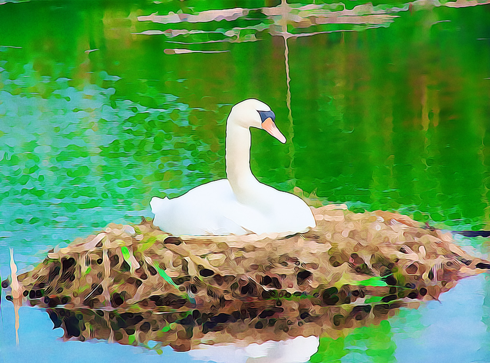


_"Si un lector no puede descubrir el significado de las oraciones individuales que componen un texto, eso será un gran obstáculo para la comprensión de todo el texto"._&emsp;Cheryl Scott.  
 
Y, ¿recuerdas que usar la imaginación es un requisito para comprender un texto narrativo?  
 
Hoy vamos a poner esta estrategia en práctica:  

**A medida que realices la lectura imagina lo que cada oración describe.** Esto te permitirá tener una idea más clara del texto y mejorar tu comprensión.  
 
Al final, selecciona una oración completa de la lectura, escríbela en tu cuaderno y elaborar un dibujo que describa lo que se relata en esa oración. 


---

## Capítulo 8. La laguna de las sirenas (continuación)

(En la roca de los Abandonados, Garfio habla con Starkey y Smee. Wendy y Peter los observan desde el agua.)

-Se acabó el juego -exclamó Garfio-, esos chicos han encontrado una madre.

Asustada como estaba, Wendy se llenó de orgullo. 

-Oh, día fatídico -soltó Starkey.

-¿Qué es una madre? -preguntó el ignorante de Smee. Wendy se quedó tan pasmada que exclamó:

-¡No lo sabe!

Y a partir de entonces siempre le pareció que si se pudiera tener un pirata mascota Smee sería el suyo.

Peter la sumergió en el agua, porque Garfio se había levantado, gritando:

-¿Qué ha sido eso?  

-Yo no he oído nada -dijo Starkey, levantando el farol por encima de las aguas y mientras los piratas miraban contemplaron una extraña visión. Era el nido del que os he hablado, que flotaba en la laguna y el ave de Nunca Jamás estaba posada en él.


¿Te gustaría ver la imagen que elaboré para esta actividad?  
Pero, no la puedes copiar.

Clic aquí para ver mi dibujo

<em>"Era el nido del que os he hablado, que <strong>flotaba</strong> en la laguna y el ave de Nunca Jamás <strong>estaba posada</strong> en él."</em>

 

  

-Mirad -dijo Garfio contestando a la pregunta de Smee-, eso es una madre. ¡Qué lección! El nido debe de haber caído al agua, ¿pero abandonaría la madre los huevos? No.

Se le quebró la voz, como si por un momento recordara tiempos inocentes en que… pero apartó esta debilidad con el garfio.

Smee, muy impresionado, contempló al ave mientras el nido pasaba con la corriente, pero Starkey, más suspicaz, dijo:

-Si es una madre, a lo mejor está por aquí para ayudar a Peter.

Garfio hizo una mueca.

-Sí -dijo-, ése es el temor que me atormenta.

La voz agitada de Smee lo sacó de su abatimiento. 

-Capitán -dijo Smee-, ¿no podríamos raptar a la madre de esos chicos y convertirla en nuestra madre?

-Es un plan estupendo -gritó Garfio y al momento cobró forma factible en su gran cerebro-. Atraparemos a los niños y los llevaremos al barco: a los chicos los pasaremos por la plancha y Wendy será nuestra madre.

Wendy volvió a perder el control. 

-¡Jamás! -gritó y se sumergió. 

-¿Qué ha sido eso?

Pero no vieron nada. Pensaron que no había sido más que una hoja movida por el viento.

-¿Estáis de acuerdo, muchachotes míos? -preguntó Garfio.

-Aquí está mi mano -dijeron los dos. 

-Y aquí está mi garfio. Juremos.

Todos juraron. Para entonces ya estaban en la roca y de pronto Garfio se acordó de Tigridia.

-¿Dónde está la india? -preguntó bruscamente.

A veces tenía ganas de broma y creyeron que ésta era una de esas veces.

-No pasa nada, capitán -contestó Smee complacido-, la hemos soltado.

-¡Que la habéis soltado! -exclamó Garfio.

-Ésas fueron sus órdenes -titubeó el contramaestre. 

-Usted nos llamó desde el agua para que la soltáramos -dijo Starkey.

-Por todos los demonios -vociferó Garfio-, ¿qué traición es ésta?

Se le puso la cara negra de rabia, pero se dio cuenta de que estaban convencidos de lo que decían y se sintió alarmado. 

-Muchachos -dijo, algo tembloroso-, yo no he dado esa orden.

-Pues es muy raro -dijo Smee y todos se agitaron inquietos. Garfio levantó la voz, pero le salió temblorosa. 

-Espíritu que esta noche rondas por esta oscura laguna -gritó-, ¿me oyes?

Como es lógico, Peter debería haberse quedado callado, pero naturalmente no lo hizo. Inmediatamente contestó con la voz de Garfio:

-Por mil diablos tuertos, te oigo.

En ese momento culminante Garfio no se amedrentó, ni siquiera un poquito, pero Smee y Starkey se abrazaron aterrorizados.

-¿Quién eres, desconocido? Habla -exigió Garfio.

-Soy James Garfio -replicó la voz-, capitán del Jolly Roger. 

-No es cierto, no es cierto -gritó Garfio con voz ronca. 

-Por todos los demonios -contestó la voz-, repite eso y te paso por debajo de la quilla.

Garfio probó una actitud más conciliadora.

-Si eres Garfio -dijo casi con humildad-, dime, ¿quién soy yo?

-Un bacalao -replicó la voz-, nada más que un bacalao. 

-¡Un bacalao! -repitió Garfio sin comprender y entonces y sólo entonces, su orgullo se desmoronó. Vio cómo sus hombres se apartaban de él.

-¿Nos ha estado dirigiendo un bacalao todo este tiempo? -mascullaron-. Es denigrante para nuestro orgullo.

Sus propios perros se volvían contra él, pero, por muy trágica que se hubiera vuelto su situación, apenas les hizo caso. Ante unas pruebas tan pavorosas no era la confianza de ellos lo que necesitaba, sino la suya propia. Sentía que su ego se le escapaba.

-No me abandones, muchachote -le susurró roncamente. En aquella oscura personalidad había un toque femenino, como en todos los grandes piratas y éste a veces le daba intuiciones. De pronto optó por jugar a las adivinanzas.

-Garfio -llamó-, ¿tienes otra voz?

Peter jamás podía resistirse a un juego y contestó alegremente con su propia voz:

-Sí.

-¿Y otro nombre? 

-Sí.

-¿Vegetal? -preguntó Garfio. 

-No.

-¿Mineral? 

-No. 

-¿Animal? 

-Sí. 

-¿Hombre?

-¡No! -la respuesta resonó cargada de desprecio. 

-¿Niño?

-Sí.

-¿Niño corriente? 

-¡No!

-¿Niño maravilloso?

Para disgusto de Wendy la respuesta que se oyó esta vez fue:

-Sí.

-¿Estás en Inglaterra? 

-No.

-¿Estás aquí? 

-Sí.

Garfio estaba totalmente desconcertado.

-Preguntadle algo vosotros -les dijo a los otros, enjugándose la frente sudorosa.

Smee reflexionó.

-No se me ocurre nada -dijo apesadumbrado.

-No lo saben, no lo saben -canturreó Peter-. ¿Os rendís? Por supuesto, por vanidad estaba llevando el juego demasiado lejos y los bellacos vieron su oportunidad.

-Sí, sí -contestaron impacientes.

-Pues muy bien -gritó él-, soy Peter Pan. 

¡Pan!

Al momento Garfio volvió a ser el de siempre y Smee y Starkey sus fieles secuaces.

-Ya lo tenemos -gritó Garfio-. Al agua, Smee. Starkey, vigila el bote. Cogedlo vivo o muerto.

Daba saltos mientras hablaba y al mismo tiempo se oyó la alegre voz de Peter.

-¿Estáis listos, chicos?

-Sí -contestaron desde diversos puntos de la laguna. 

-Pues dadles una paliza a los piratas.

La lucha fue breve y cruenta. El primero en cobrarse una víctima fue John, que subió valientemente al bote y agarró a Starkey. Hubo una dura pelea, en la que al pirata le fue arrebatado el sable. Se tiró por la borda y John saltó tras él. El bote se alejó a la deriva.

Aquí y allá surgía una cabeza en el agua y se veía un destello metálico, seguido de un grito o un alarido. En la confusión algunos atacaban a los de su propio bando. El sacacorchos de Smee hirió a Lelo en la cuarta costilla, pero él fue herido a su vez por Rizos. A mayor distancia de la roca Starkey hacía sudar a Presuntuoso y a los gemelos.

¿Dónde estaba Peter a todo esto? Estaba persiguiendo una presa más grande.

Todos los demás eran chicos valientes y no se les debe echar en cara que se apartaran del capitán pirata. Su garra de hierro trazaba un círculo de muerte en el agua, del que huían como peces asustados.

Pero había uno que no lo temía: uno dispuesto a penetrar en ese círculo.

Por raro que parezca, no fue en el agua donde se encontraron. Garfio se subió a la roca para respirar y en ese mismo momento Peter la escaló por el lado opuesto. La roca estaba resbaladiza como un balón y más bien tenían que arrastrarse en lugar de trepar. Ninguno de los dos sabía que el otro se estaba acercando. Al tantear cada uno buscando un asidero tropezaron con el brazo del contrario: sorprendidos, alzaron la cabeza; sus caras casi se tocaban; así se encontraron.

Algunos de los héroes más grandes han confesado que justo antes de entrar en combate les entró un momentáneo temor. Si en ese momento eso le hubiera ocurrido a Peter yo lo admitiría. Al fin y al cabo, éste era el único hombre al que el Cocinero había temido. Pero a Peter no le dio ningún miedo, sólo sintió una cosa, alegría, y rechinó los bonitos dientes con entusiasmo. Rápido como un rayo le quitó a Garfio un cuchillo del cinturón y estaba a punto de clavárselo, cuando se dio cuenta de que estaba situado en la roca más arriba que su enemigo. No habría sido una lucha justa. Le alargó la mano al pirata para ayudarlo a subir.

Entonces Garfio lo mordió.

No fue el dolor, sino lo injusto del asunto, lo que atontó a Peter. Lo dejó impotente. Sólo podía mirar, horrorizado. Todos los niños reaccionan así la primera vez que los tratan con injusticia. A lo único que piensan que tienen derecho cuando se le acercan a uno de buena fe es a un trato justo. Después de que uno haya sido injusto con ellos seguirán queriéndolo, pero nunca volverán a ser los mismos. Nadie supera la primera injusticia: nadie excepto Peter. Se topaba a menudo con ella, pero siempre se le olvidaba. Supongo que ésa era la auténtica diferencia entre todos los demás y él.

De forma que cuando ahora se encontró con ello fue como la primera vez y lo único que pudo hacer fue quedarse boquiabierto, impotente. La mano de hierro lo golpeó dos veces.

Pocos minutos después los demás chicos vieron a Garfio en el agua nadando frenéticamente hacia el barco; su cara pestilente ya no estaba llena de regocijo, sólo blanca de miedo, pues el cocodrilo le venía pisando los talones. En una ocasión normal los chicos habrían nadado al lado soltando gritos de entusiasmo, pero ahora se sentían inquietos, porque habían perdido tanto a Peter como a Wendy y estaban recorriendo la laguna buscándolos, gritando sus nombres. Encontraron el bote y regresaron a casa en él, gritando «Peter, Wendy» por el camino, pero no se oía ninguna respuesta salvo la risa burlona de las sirenas.

-Deben de estar volviendo a nado o por el aire -decidieron los chicos. No estaban muy preocupados, por la fe que tenían en Peter. Se echaron a reír, como niños que eran, al pensar que se irían tarde a la cama ¡y todo por culpa de mamá Wendy!

Cuando sus voces se apagaron cayó un frío silencio sobre la laguna y entonces se oyó un débil grito.

-¡Ayuda, ayuda!

Dos figuritas golpeaban contra la roca; la chica había perdido el conocimiento y yacía en los brazos del chico. Con un último esfuerzo Peter la subió a la roca y luego se echó junto a ella. En el momento en que también él se desmayaba vio que el agua estaba subiendo. Supo que pronto estarían ahogados, pero no podía hacer más.

Mientras yacían el uno junto al otro una sirena agarró a Wendy de los pies y se puso a tirar de ella suavemente hacia el agua. Peter, al sentir que se soltaba de él, volvió en sí de golpe y llegó justo a tiempo de rescatarla. Pero tenía que decirle la verdad.

-Estamos en la roca, Wendy -dijo-, pero se está cubriendo. El agua no tardará en cubrirla del todo.

Ni siquiera entonces lo entendió ella. 

-Tenemos que irnos -dijo casi con animación. 

-Sí -respondió él débilmente.

-¿Nadamos o volamos, Peter?

No le quedó más remedio que decírselo.

-Wendy, ¿crees que podrías nadar o volar hasta la isla sin mi ayuda?

Ella tuvo que admitir que estaba demasiado cansada. Él soltó un gemido.

-¿Qué te ocurre? -preguntó ella, preocupada por él al instante.

-No te puedo ayudar, Wendy. Garfio me ha herido. No puedo ni volar ni nadar.

-¿Quieres decir que nos vamos a ahogar los dos? 

-Mira cómo sube el agua.

Se taparon los ojos con las manos para evitar aquella visión. Pensaron que no tardarían en morir. Mientras estaban así sentados una cosa rozó a Peter con la levedad de un beso y se quedó allí, como preguntando tímidamente: «¿Puedo servir para algo?»

Era la cola de una cometa, que Michael había construido unos días antes. Se le había escapado de las manos y se había alejado volando.

-La cometa de Michael -dijo Peter con indiferencia, pero un momento después la tenía agarrada por la cola y tiraba de la cometa hacia él-. Levantó a Michael del suelo -exclamó-, ¿por qué no podría llevarte a ti?

-¡A los dos!

-No puede levantar a dos personas, Michael y Rizos lo intentaron.

-Echémoslo a suertes -dijo Wendy con valentía. 

-¿Una dama como tú? Ni hablar.

Ya le había atado la cola alrededor. Ella se aferró a él: se negaba a partir sin él, pero con un «adiós, Wendy», la apartó de un empujón. La cometa elevó a Wendy, alejándola de la laguna. A los pocos minutos desapareció de su vista por los aires. Peter se quedó solo en la laguna.

La roca era muy pequeña ya, pronto quedaría sumergida. Unos pálidos rayos de luz se deslizaron por las aguas y luego se oyó un sonido que al mismo tiempo era el más musical y el más triste del mundo: las sirenas cantando a la luna.

Peter no era como los demás chicos, pero por fin sentía miedo. Le recorrió un estremecimiento, como un temblor que pasara por el mar, pero en el mar un temblor sucede a otro hasta que hay cientos de ellos y Peter sintió solamente ése. Al momento siguiente estaba de nuevo erguido sobre la roca, con esa sonrisa en la cara y un redoble de tambores en su interior. Éste le decía: «morir será una aventura impresionante.»


Hemos terminado la lectura de hoy. Recuerda:  
- Seleccionar una oración y copiarla en el cuaderno. (No puedes elegir la del nido flotando con el ave, porque esa ya la empleó Aike.) 
- Elaborar un dibujo que describa la oración que seleccionaste.
- Copiar en tu glosario la definición de las palabras desconocidas que encontraste hoy.

