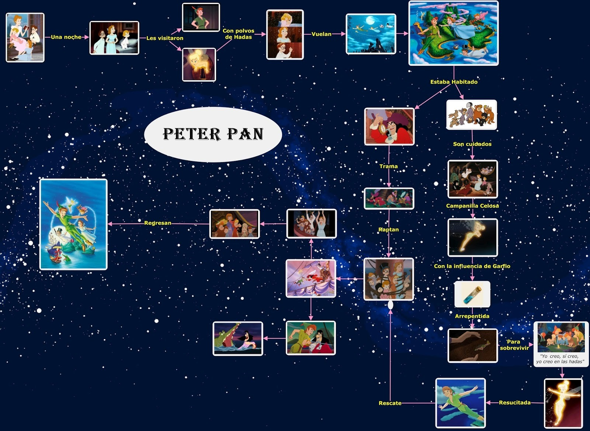


Para finalizar nuestro curso de comprensión lectora trabajaremos en parejas para elaborar en el cuaderno un resumen de la novela que hemos leído, mediante algún esquema u organizador gráfico.  

Para comenzar, veamos el siguiente video con ejemplos. 






Ahora, puedes trabajar con tu compañero/a para elaborar en una o dos páginas un organizador gráfico con los elementos y sucesos más importantes de la novela "Peter Pan y Wendy".  
Para esto, pueden elegir entre uno de los tipos vistos en el video: 
- Mapa mental.
- Línea de tiempo.
- Cuadro sinóptico.
- o una combinación de estos.

Elijan el tipo que les guste más para elaborar el resumen de la novela.

Para recordar los detalles del texto pueden revisar las actividades anteriores.




Hola. 

¿Te gustaría ver cómo quedó mi organizador gráfico?
Pero, ¡no la puedes copiar! Es únicamente para guiarte en una de tantas formas de hacerlo.

Clic aquí para ver mi dibujo

Lo elaboré como una mezcla entre mapa mental y línea de tiempo.

 

